# Проект по автоматизации тестирования для компании [NOVO-DOM](https://novo-dom.ru/) — цифровое агентство недвижимости, которое предлагает услуги по продаже и подбору квартир в новостройках Москвы и Московской области. 


# <a name="TableOfContents">Содержание страницы</a>
+ [Описаниe](#Description)
+ [:trophy: Инструменты и технологии](#ToolsAndTechnologies)
+ [:computer: Запуск локально](#Launch_from_terminal)
  - <a href="#console-ui"> UI
  - <a href="#console-api"> API
  - <a href="#console-remote"> Remote
+ [:clipboard: Параметры сборки в Jenkins:](#Build_Parameters_in_Jenkins)
+ [:clipboard: Сборка в Github:](#Github)
+ [:chart_with_downwards_trend: Allure отчет](#Allure_report)
  + [Главный экран отчета](#Allure_report1)
  + [Страница с проведенными тестами](#Allure_report2)
+ [:bar_chart: Интеграция с Allure TestOps](#Integration_Allure_TestOps)
+ [:iphone: Отчет в Telegram](#Telegram)
+ [:movie_camera: Видео пример прохождения тестов](#Video)
  
<a name="Description"><h2>Описаниe</h2></a>
Тестовый проект состоит из UI и API автотестов. Автотесты в этом проекте написаны на `Java` с использованием `Selenide`.\
Краткий список интересных фактов о проекте: \
`Page Object` проектирование  \
`Параметризованные тесты` \
Конфигурация с библиотекой `Owner` \
`Custom Allure listener` для API requests/responses логов \
`Gradle` - для автоматической системы сборки.  \
`Jenkins` - CI/CD для удаленного запуска тестов.\
`Selenoid` - для удаленного запуска браузеров в `Docker` контейнере.\
`Allure Report` - для визуализации результатов тестирования.\
`Telegram Bot` - для уведомлений о результатах тестирования.\
`Allure TestOps` - система управления тестированием
`Rest Assured` - выполняет роль обёртки над http клиентом

<a name="ToolsAndTechnologies"><h2>:trophy: Инструменты и технологии</h2></a>
<p  align="center">
  <a href="https://www.jetbrains.com/idea/"><code></code></a>
  <a href="https://www.java.com/"><code></code></a>
  <a href="https://selenide.org/"></a><code></code></a>
  <a href="https://aerokube.com/selenoid/"><code></code></a>
  <a href="https://gradle.org/"><code></code></a>
  <a href="https://junit.org/junit5/"><code></code></a>
  <a href="https://docs.qameta.io/allure/"><code></code></a>
  <a href="https://qameta.io/"><code></code></a>
  <a href="https://github.com/"><code></code></a>
  <a href="https://git-scm.com/"><code></code></a>
  <a href="https://www.jenkins.io/"><code></code></a>
  <a href="https://www.atlassian.com/ru/software/jira"><code></code></a>
  <a href="https://telegram.org/"><code></code></a>
  <a href="https://rest-assured.io/"><code></code></a>
</p>

<a name="Launch_from_terminal"><h2>:computer: Запуск локально</h2></a>
### <a id="console-ui"></a>Локальный запуск UI-тестов

```
gradle clean novoWeb
```

### <a id="console-api"></a>Локальный запуск API-тестов

```
gradle clean novoApi
```

### <a id="console-mobile"></a>Локальный запуск всех тестов

```
gradle clean test
```
### <a id="console-remote"></a>Запуск тестов на selenoid

```
gradle test -Denv=remote
```
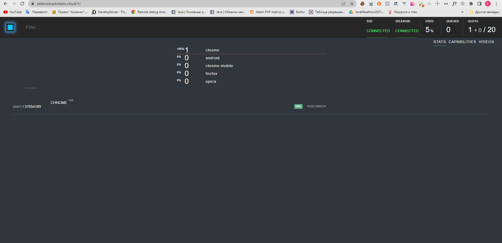
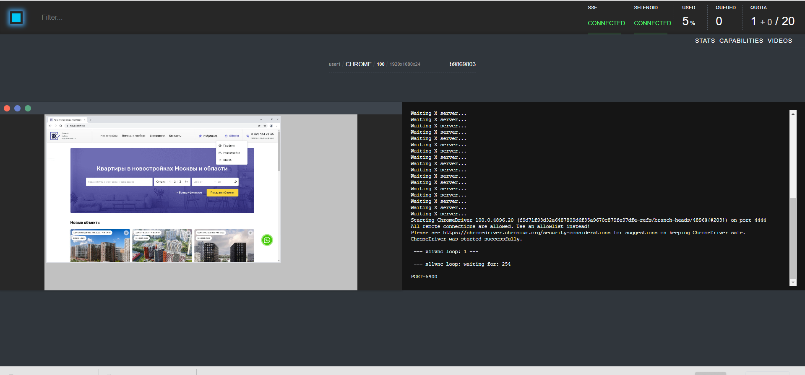
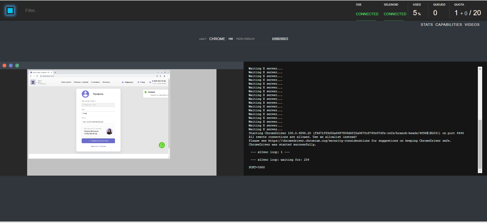
  
<a name="Build_Parameters_in_Jenkins"><h2>:clipboard: Параметры сборки в Jenkins:</h2></a>

Сборка в Jenkins

- TASK (с какими тегами запускать тесты)

- BROWSER (браузер, по умолчанию chrome)

- BROWSER_VERSION (версия браузера, по умолчанию 100.0)

- BROWSER_SIZE (размер окна браузера, по умолчанию 2500х1080)

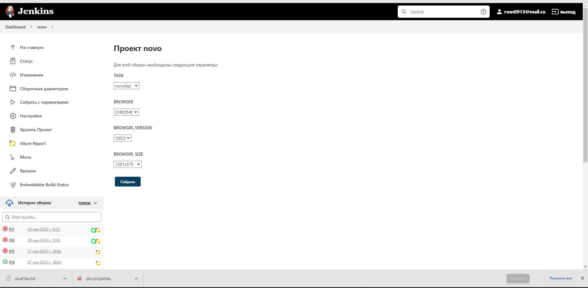
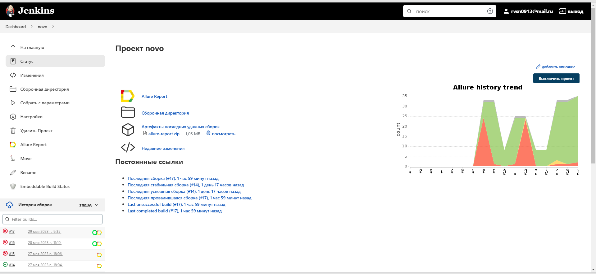
  
<a name="Github"><h2>:clipboard: Сборка в Github на странице Actions с формированием Allure report:</h2></a>
  
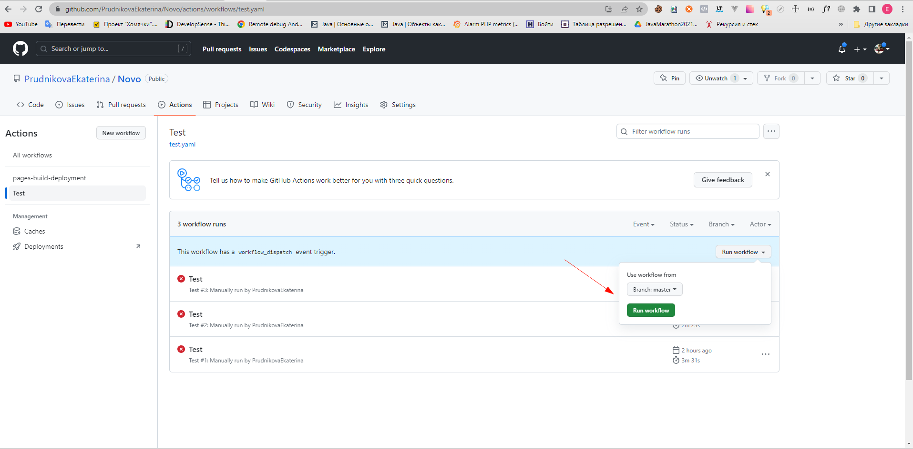
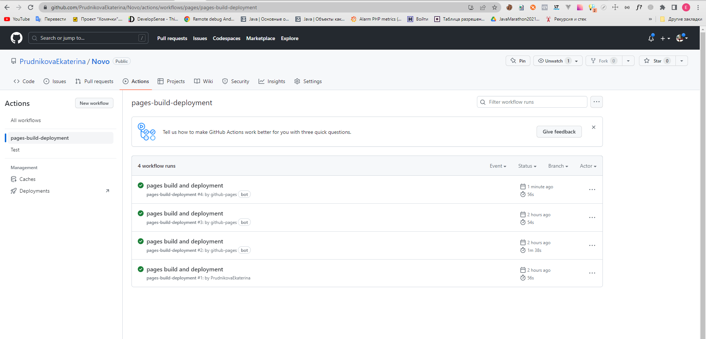
 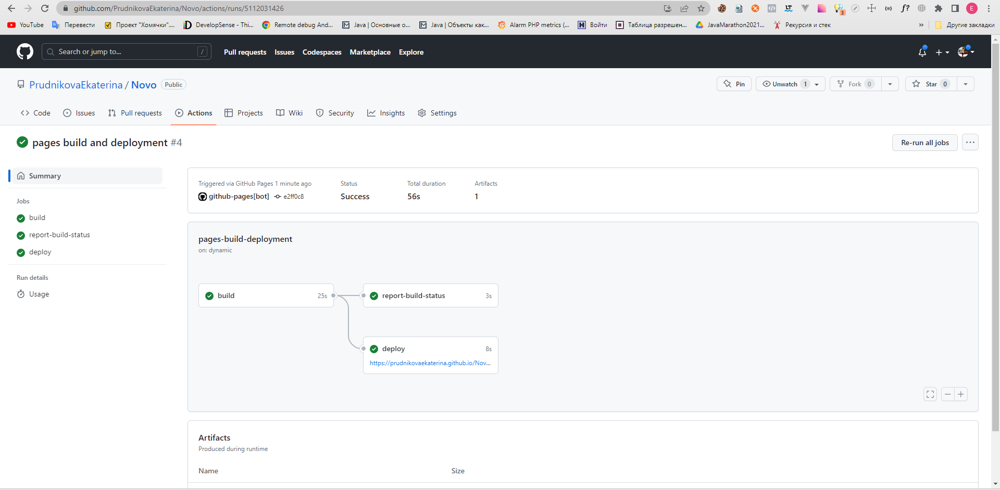
  
<a name="Allure_report"><h2>:chart_with_downwards_trend: [Allure](https://jenkins.autotests.cloud/job/novo/) отчет</h2></a>

- <a name="Allure_report1"><h3>Главный экран отчета</h3></a>

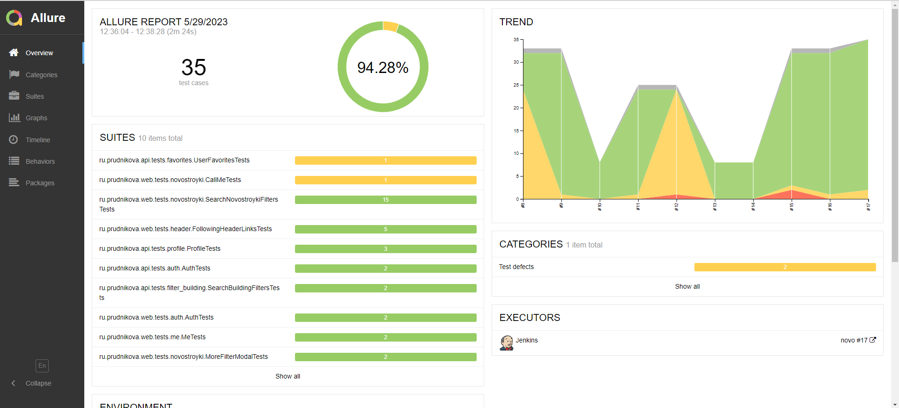

-  <a name="Allure_report2"><h3>Страница с проведенными тестами</h3></a>

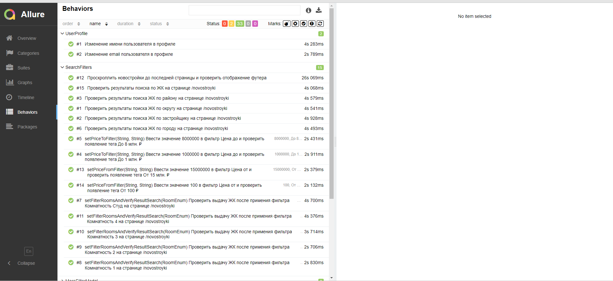

<a name="Integration_Allure_TestOps"><h2>:bar_chart: Интеграция с Allure [TestOps](https://allure.autotests.cloud/launch/24448)</h2></a>

- <a name="Integration_Allure_TestOps1"><h3>Экран с результатами запуска тестов</h3></a>

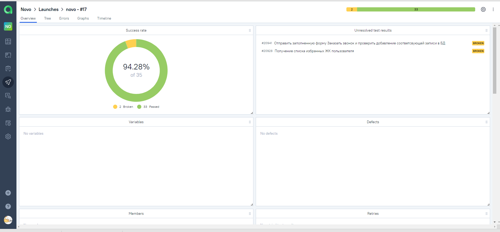


- <a name="Integration_Allure_TestOps2"><h3>Страница с тестами в [TestOps](https://allure.autotests.cloud/launch/24091/tree?treeId=4235)</h3></a>

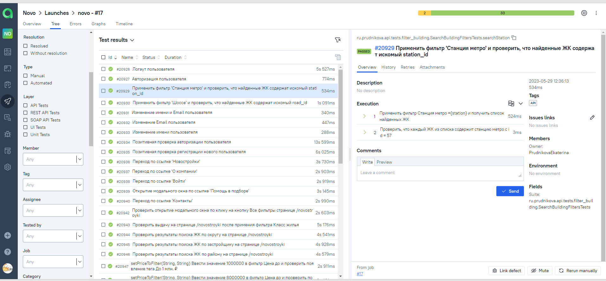

<a name="Telegram"><h2>:iphone: Отчет в Telegram</h2></a>

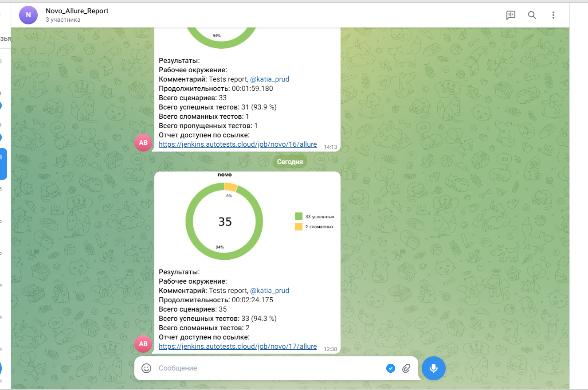
  
<a name="Video"><h2>:movie_camera: Видео пример прохождения тестов</h2></a>

https://github.com/PrudnikovaEkaterina/Novo/blob/master/design/video/499795bd7c887581758586676ca83ff3%20-%20Trim.mp4
