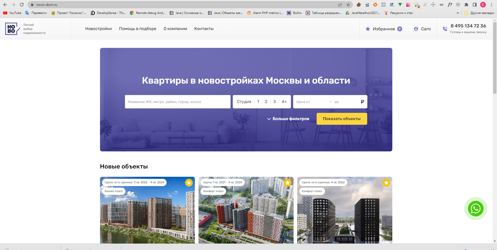

# Проект по автоматизации тестирования для компании [NOVO-DOM](https://novo-dom.ru/) — цифровое агентство недвижимости, которое предлагает услуги по продаже и подбору квартир в новостройках Москвы. 

# <a name="TableOfContents">Содержание страницы</a>
+ [Описаниe](#Description)
<a name="Description"><h2>Описаниe</h2></a>
Тестовый проект состоит из UI и API автотестов. Автотесты в этом проекте написаны на `Java` с использованием `Selenide`.\
Краткий список интересных фактов о проекте: 
`Page Object` проектирование  \
`Параметризованные тесты` \
`Gradle` - для автоматической системы сборки.  \
`JUnit5` - для модульного тестирования.\
`Jenkins` - CI/CD для удаленного запуска тестов.\
`Selenoid` - для удаленного запуска браузеров в `Docker` контейнере.\
`Allure Report` - для визуализации результатов тестирования.\
`Telegram Bot` - для уведомлений о результатах тестирования.\
`Allure TestOps` - система управления тестированием
`Rest Assured` - выполняет роль обёртки над http клиентом
